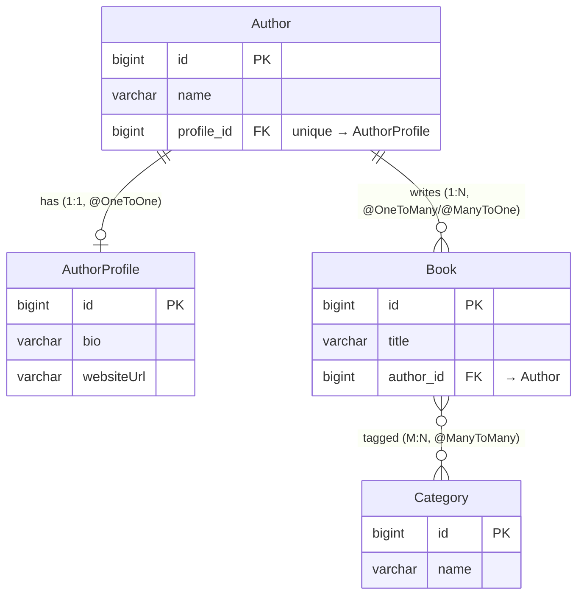
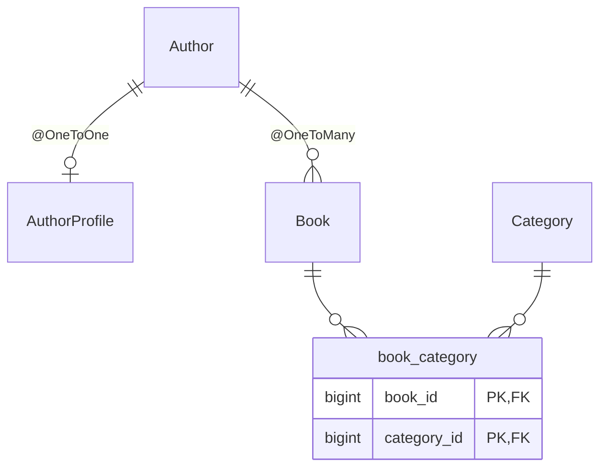

# Entity Relationships

The example domain (`app/src/main/java/org/example/model/`) is a small library: authors
write books, each author has a profile, and books are tagged with categories. It covers every
core Hibernate relationship type.

## Overview

Reading the cardinality symbols (left-to-right):

- `||--o|` — **one-to-one**: an Author has zero-or-one AuthorProfile. The `profile_id` FK
  (marked `unique`) lives on `Author`, the owning side.
- `||--o{` — **one-to-many**: an Author writes zero-or-more Books; each Book has one Author.
  The `author_id` FK lives on `Book` (the "many" / owning side); `Author.books` is `mappedBy`.
- `}o--o{` — **many-to-many**: Books and Categories, physically the `book_category` join table.

## With the join table as an explicit entity

This is closer to the actual schema (see `./gradlew :app:schema`):

## Owning vs. inverse side

Hibernate writes the foreign key based on the **owning** side of each association:

| Relationship | Owning side (holds FK)        | Inverse side (`mappedBy`)      |
| ------------ | ----------------------------- | ------------------------------ |
| one-to-one   | `Author.profile`              | `AuthorProfile` (no back-ref)  |
| one-to-many  | `Book.author` (`@ManyToOne`)  | `Author.books`                 |
| many-to-many | `Book.categories` (`@JoinTable`) | `Category.books`            |

See [`App.java`](../app/src/main/java/org/example/App.java) for runnable queries that traverse
each relationship, and run the demo with `./gradlew :app:run`.
